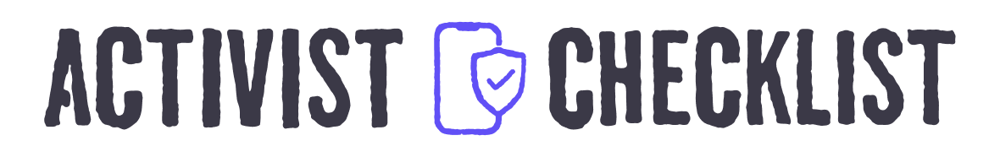

<div align="center">

[](https://activistchecklist.org/)
[ActivistChecklist.org](https://activistchecklist.org)

**Practical digital security guides for activists and organizers.**

[](https://github.com/ActivistChecklist/ActivistChecklist/actions/workflows/pr-checks.yml)
[](https://github.com/ActivistChecklist/ActivistChecklist/actions/workflows/deploy-webhook.yml)
[](https://github.com/ActivistChecklist/ActivistChecklist/blob/main/package.json)
[](LICENSE-CODE)
[](https://creativecommons.org/licenses/by-sa/4.0/)

[Visit the site](#visit-the-site) • [Edit content](#edit-content) • [Local development](#local-development) • [Repository layout](#repository-layout) •  [License](#license)

</div>

---

## Visit the site

You can view the live site here: **[ActivistChecklist.org →](https://activistchecklist.org)**

## Edit content

You don't need to be a coder to make edits to this site. The site has a **visual editor** so you can propose changes. All you need is a GitHub account.

Instructions: **[Contribute to Activist Checklist →](https://activistchecklist.org/contribute/)**

## Local development

**Prerequisites (macOS):** Install [Homebrew](https://brew.sh) if you do not have it, then:

```bash
brew install node yarn ffmpeg exiftool
```

That gives you Node and Yarn for this project, plus **ffmpeg** and **exiftool** used by the image/video metadata scrubbing (`yarn metadata scrub`). On Linux or Windows, install the same tools with your package manager or each tool’s official packages.

```bash
# Get started
git clone https://github.com/ActivistChecklist/ActivistChecklist.git
cd ActivistChecklist
yarn install
cp .env.template .env   # defaults are fine for basic editing
yarn dev
```

- **Site:** You can view the site at [http://localhost:3000](http://localhost:3000)
- **Fastify API (contact, stats, newsletter):** port `4321` by default (`API_PORT`), routes under `/api-server/` — The site runs fine without this API

## Repository layout

```text
ActivistChecklist.org
├── app/           Next.js App Router (pages, API routes, Keystatic)
├── api/           Fastify server (/api-server/ — separate from the Next.js app)
├── components/    React UI
├── config/        Navigation, icons, site config
├── content/       MDX source (English under content/en/, etc.)
├── hooks/         React hooks
├── i18n/          Internationalization
├── lib/           Shared libraries
├── public/        Static assets
├── scripts/       Build, deploy, and tooling
├── styles/        CSS
└── utils/         Helpers
```

## License

- **Code:** [GNU General Public License v3.0](LICENSE-CODE)
- **Content and non-code assets:** [CC BY-SA 4.0](https://creativecommons.org/licenses/by-sa/4.0/)
